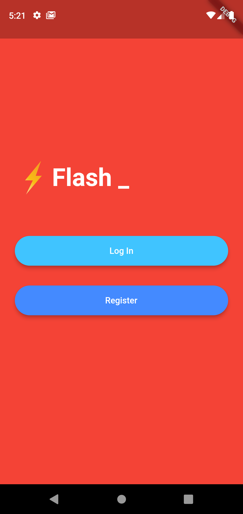
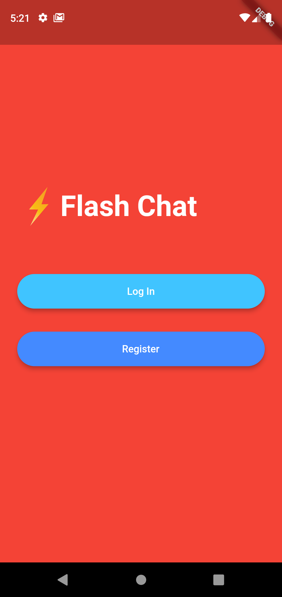
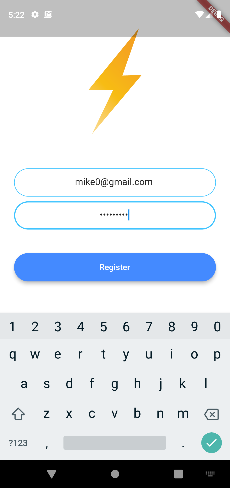
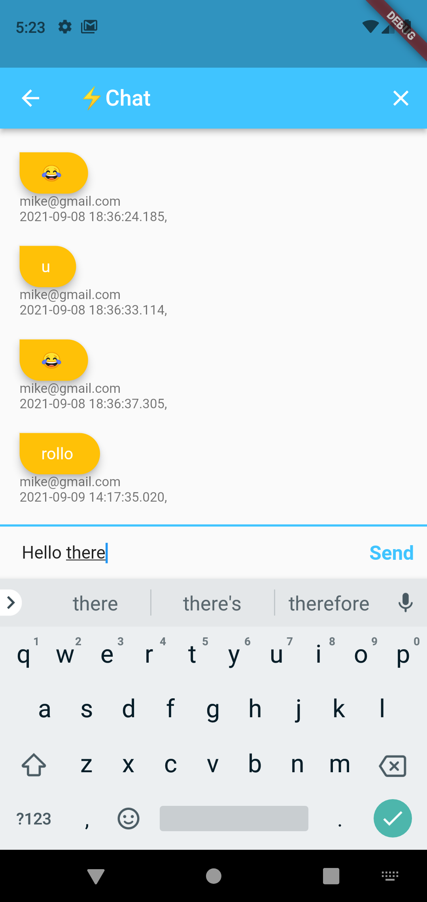
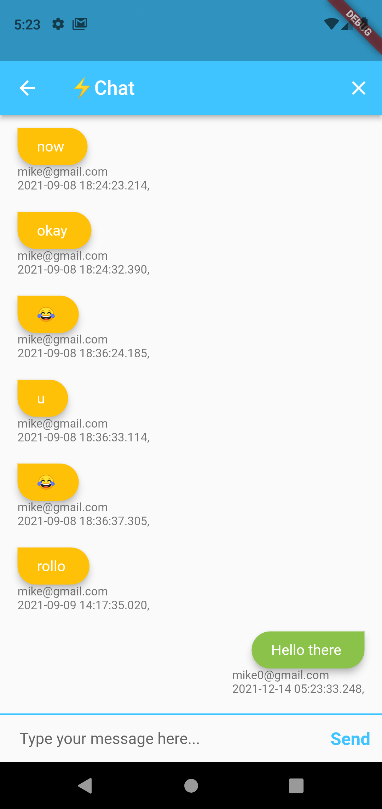

# FlashChat  

A simple Flutter chat application. 

 

[Firebase](http://www.firebase.com) was used to authenticate user.  

  Please star⭐ the repo if you like what you see😉.

## 💻 Requirements

- Any Operating System (ie. MacOS X, Linux, Windows)
- Any IDE with Flutter SDK installed (ie. IntelliJ, Android Studio, VSCode etc)
- Knowledge of Dart and Flutter

## ✨ Features

- [x] Text Animation.
- [x] User registration.
- [x] User authentication.
- [x] cloud firestore

## 📸 ScreenShots

<!--  -->

|                                   |                                   |
| --------------------------------- | --------------------------------- |
|   |   |
|   |   |
|   | 

## 🔌 Plugins

| Name                                                    | Usage                                               |
| ------------------------------------------------------- | --------------------------------------------------- |
| **Animated Text kit**       | Text Animation                                    |
| Cloud Firestore   | NoSQL database to store messages       |
| Firebase Auth       | User authentication                                 |
| Modal Progress Hud                 | sign in progress indicator                    |
|

## 🤓 Author(s)

**Fadowo Michael**

